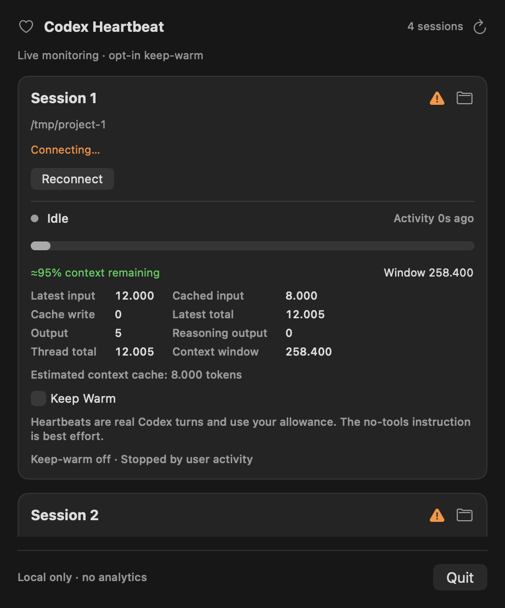

# ♥ Codex Heartbeat

**Step away. Keep an eye on your context. Pick up where you left off.**

## Why Heartbeat?

A long coding session builds valuable context. When you step away for lunch, its prompt cache may expire, making your next request slower or requiring expensive context processing again. Keeping a terminal open does not guarantee the cache stays available.

Codex Heartbeat puts your managed Codex sessions in the macOS menu bar: see activity, token usage, and estimated context remaining at a glance. Before a short break, optionally enable **Keep Warm** to send two minimal background turns that may help preserve cache reuse.

**Monitoring is passive. Keep Warm is opt-in, consumes Codex allowance, and cannot guarantee cache retention.** Uses your existing Codex login; no separate API key is required.

## A look at the menu



*Actual SwiftUI view rendered with example data, in dark mode. The test session is disconnected, so it shows Reconnect. Light mode is also supported.*

| Menu-bar heart | Meaning |
| :---: | --- |
| **♡** | Monitoring; no Keep Warm schedule enabled |
| **♥** | At least one Keep Warm schedule enabled |
| **♥̸ ⚠** | A connection, thread, or heartbeat warning needs attention |

Each session shows its directory, thread activity, latest token counts, cached input, and context estimate. Additional cards scroll. **Idle** means no turn is currently running; it says nothing about cache residency.

Usage updates after a model request. If figures are missing, send a normal prompt and let it finish while Heartbeat is running. Refresh never sends a model turn. Context remaining is an estimate from the latest reported usage, not your remaining subscription allowance; cached-input figures describe the last request, not a live cache inventory.

## Get started

Requires **macOS 13+**, **Swift 5.9+**, and the **Codex CLI** on your `PATH`. Sign in with `codex login` first.

From the repository directory:

```sh
sh scripts/build-app.sh
open "dist/Codex Heartbeat.app"
```

Install the launcher on your `PATH`, or invoke `dist/bin/codex-heartbeat` by its absolute path. Then, in your project terminal:

```sh
codex-heartbeat
codex-heartbeat resume --last
codex-heartbeat fork --last
codex-heartbeat --model MODEL --cd /path/to/project --no-alt-screen
```

Only sessions started through the launcher appear in the menu. Start one in each terminal you want to monitor. `/quit` cleans up that managed session.

### Use it as your normal `codex` command

With `codex-heartbeat` on your `PATH`, add this to your shell profile:

```sh
alias codex='codex-heartbeat'
```

The alias forwards the same CLI arguments to the launcher: `codex resume --last`, model/configuration flags, sandbox settings, and other options work as they do with the real CLI. The launcher finds the installed `codex` executable directly, so the shell alias does not recurse.

For new interactive sessions, `resume`, and `fork`, it adds its private loopback App Server connection while preserving your arguments and normal CLI behavior. It does not change your model, sandbox, approvals, or resume directory choice. Other commands such as `login`, `mcp`, and `exec` pass through unmonitored, as do explicit `--remote`/`--no-daemon` and unrecognized options. Thus it is a wrapper around the installed CLI, with monitoring added to supported interactive sessions.

Keep CLI flags before any `--` separator; text after it is positional prompt text. Use `codex-heartbeat --heartbeat-help` for wrapper options.

## A lunch-break heartbeat

Enable **Keep Warm** on an idle, connected thread before leaving:

| Time after enabling | What happens |
| :---: | --- |
| **0 min** | ♥ Countdown starts |
| **≈25 min** | First “do nothing, reply OK” turn |
| **≈50 min** | Second turn; schedule ends after completion |
| **You return** | A submitted user turn cancels any remaining schedule |

The app and Mac must remain available to send the turns. There is no indefinite loop or immediate-heartbeat button. Reconnect, app restart, errors, and compaction stop the schedule; re-enabling is always explicit.

Heartbeats use the existing thread and its configuration. The instruction to avoid tools is **best effort**, not an enforceable no-tools guarantee. If a tool starts, the app stops the schedule and attempts to interrupt its heartbeat. See the [technical guide](docs/technical-guide.md) for details.

## Does keeping warm pay off?

A tiny heartbeat prompt still sends the thread’s context. It is worthwhile only when the extra cache reuse outweighs the heartbeat turns themselves. Stable, substantial context and a predictable return to the same thread make the idea more plausible; an already durable cache or an uncertain return makes it less attractive. Matching prefixes, routing, and retention determine actual reuse. [OpenAI prompt caching](https://developers.openai.com/api/docs/guides/prompt-caching)

### Example: one million tokens, two heartbeats, one return

**Hypothetical rates per 1,000,000 tokens:** a cold cache write costs **$2.50**; a cached read costs **$0.20**. Since the example context is exactly one million tokens, those are also the costs of processing it once—no token-unit conversion needed.

Assume both heartbeats reuse the entire prefix and keep it available for your return. Compare that with a return after the cache has expired:

| Context processing | Cache expires; no heartbeats | ♥ Two successful heartbeats |
| --- | ---: | ---: |
| Heartbeat 1 | $0.00 | $0.20 |
| Heartbeat 2 | $0.00 | $0.20 |
| Your return request | $2.50 cold write | $0.20 cached read |
| **Total** | **$2.50** | **$0.60** |
| **Potential saving** | | **$1.90 · 76%** |

**The tradeoff:** if the cache would survive without help, your return costs only **$0.20**. Heartbeats instead make the total **$0.60**, adding **$0.40** for no benefit.

The arithmetic is:

```text
Successful preservation: $2.50 − (3 × $0.20) = $1.90 saved
Heartbeat overhead:      2 × $0.20          = $0.40
Avoided cold-return cost: $2.50 − $0.20      = $2.30
Break-even improvement:  $0.40 / $2.30      ≈ 17.4 percentage points
```

That break-even assumes $0.40 of heartbeat costs: they must increase the probability of a cached return by more than 17.4 percentage points. Heartbeat cache misses and new input, output, or reasoning costs raise the threshold.

*This is a simplified API illustration, not measured savings, current model pricing, or a claim that your session supports a million-token window. It excludes the initial cache creation, which both routes already paid for. Actual rates—including any long-context tier—depend on your model; see [API pricing](https://developers.openai.com/api/docs/pricing).*

**For ChatGPT-backed Codex, every heartbeat uses allowance.** The app cannot translate cached-token counts into subscription savings, set backend retention, or promise to prevent a cache rewrite. There has been no controlled savings benchmark for this project.

## More details

The app uses a private local registry and verified loopback connections. It adds no analytics and stores no chat content or credentials; Codex continues to use its normal backend and session storage.

See the [technical guide](docs/technical-guide.md) for installation, architecture, protocol limitations, and development checks.
